# Austin Jones' Periodic Tables Final Capstone

Thank you for viewing this repo. This is my final project for Thinkful's Engineering Immersion program. The PERN stack is used in this application, including but not limited to: PostgreSQL, Express.js, React.js, Node.js, and Knex.js.
<br><br>

# API Documentation

## `/reservations`

<hr>

### GET: `?date=YYYY-MM-DD`

Returns a list of reservations made for that date.

### GET: `?mobile_number={some-number}`

Returns a list of reservations that at least partially match the number query.

<i>Shape of response.data from both requests above:</i>

```
[
    {
        reservation_id: 22,
        first_name: "Austin",
        last_name: "Jones",
        mobile_number: "777-888-9999",
        reservation_date: "2022-03-12",
        reservation_time: "11:30",
        people: 2,
        status: "booked"
    },
    {
        reservation_id: 23,
        first_name: "Jane",
        last_name: "Appleseed",
        mobile_number: "444-123-6789",
        reservation_date: "2022-03-13",
        reservation_time: "21:00",
        people: 8,
        status: "booked"
    },
]
```

### POST

A request body is needed for this route. The body of your request should look like this:

```
request: {
    body: {
        data: {
            first_name: "Bob",
            last_name: "Smith",
            mobile_number: "123-456-7890",
            reservation_date: "2025-06-30",
            reservation_time: "13:30",
            people: 4,
            status: "booked"
        }
    }
}
```

<i>Sidebar - </i> All requests that send a reservation object will have a ton of data validation to pass. I've written the error responses to be descriptive about what is wrong with the request, but in short, here are the constraints for the data properties.<br>

- First name and last name have no constraints whatsoever.
- The mobile number must be in hyphenated format. xxx-xxxx or xxx-xxx-xxxx will suffice.
- Date must be in the format YYYY-MM-DD. Also, the date must occur either on the current day or in the future.
- The time must be in 24H (HH:MM) format. Also, if the date property is on today's date, the time must not have passed on that day when the request is made.
- People must be an integer greater than 0.

Returns status 201 and the created reservation object.<br><br>

## `/reservations/:reservation_id`

<hr>

### GET

If the reservation defined in the request URL exists, it returns the reservation object.

```
{
    reservation_id: 7,
    first_name: "Austin",
    last_name: "Jones",
    mobile_number: "777-888-9999",
    reservation_date: "2022-03-12",
    reservation_time: "11:30",
    people: 2,
    status: "booked"
}
```

### PUT

A request body is needed. The body of the request should resemble:

```
data: {
    first_name: "Jane",
    last_name: "Appleseed",
    mobile_number: "123-123-1231",
    reservation_date: "2021-07-26",
    reservation_time: "18:00",
    people: 2,
    status: "booked"
}
```

Returns status 200 and the updated reservation.<br><br>

## `/reservations/:reservation_id/status`

<hr>

### PUT

The body of the request must resemble:

```
data: { status: "booked" }
```

Returns status 200 and the updated reservation object.
<br><br>

## `/tables`

<hr>

### GET

Returns a list of all tables in the database.

```
[
  {
    table_id: 12,
    table_name: "Bar #4",
    capacity: 3,
    reservation_id: null
  },
  {
    table_id: 13,
    table_name: "Bar #5",
    capacity: 3,
    reservation_id: 7
  },
  ...
]
```

### POST

Body of the request must resemble:

```
data : {
    table_name: "#7",
    capacity: 6,
    reservation_id: 12
}
```

- table_name does not need to include a # sign, but it must be a string greater than one character.
- capacity must be an integer greater than 0.
- reservation_id is optional, but if one is passed, it must be the ID of a reservation that does exist in the database or very bad things will happen to your application... just kidding. You'll just get an error.

Returns 201 and the created table.
<br><br>

## `/tables/:table_id`

<hr>

### GET

If the table defined in the request URL exists, it returns the table object.
Response looks like:

```
data: {
    table_id: 12,
    table_name: "Bar #4",
    capacity: 3,
    reservation_id: null
}
```

<br>

## `/tables/:table_id/seat`

<hr>

### PUT

If the table_id passed in the parameters exists, the reservation_id passed in the body exists, and the table is currently not occupied as well as the reservation belonging to the reservation_id is only booked, and not seated, finished, or cancelled: the table will be updated with the reservation_id passed.<br>

Request body looks like this:

```
data: { reservation_id: 12 }
```

When the table is updated with a reservation_id, that means the reservation is now seated at a table. Accordingly, the reservation's status will also be updated to reflect its "seated" status.<br>
Returns status 200 and the updated <i>reservation</i>, not the table.

```
data: {
    reservation_id: 5,
    first_name: "Michael",
    last_name: "Scott,
    mobile_number: "981-123-4567",
    reservation_date: "2007-04-20",
    reservation_time: "18:00",
    people: 6,
    status: "seated"
}
```

### DELETE

If the table exists, and the table has a reservation_id property that is not null or undefined, the table's reservation_id property will be nullified.

Returns status 200 and the updated reservation object associated with the change to the table.

```
data: {
    reservation_id: 62,
    first_name: "Walter",
    last_name: "White",
    mobile_number: "505-737-4253",
    reservation_date: "2030-09-25",
    reservation_time: "14:00",
    people: 1,
    status: "finished"
}
```

<br>

# React Application

The react application for this project has three forms, one main dashboard page, and a search-by-phone page. Below, their URL's and functionality are displayed and defined.

## `/dashboard`

<hr>

By default, the /dashboard route displays all tables and the reservations that are schedules for the current date. If a reservation has been completed or canceled, it will not be displayed.

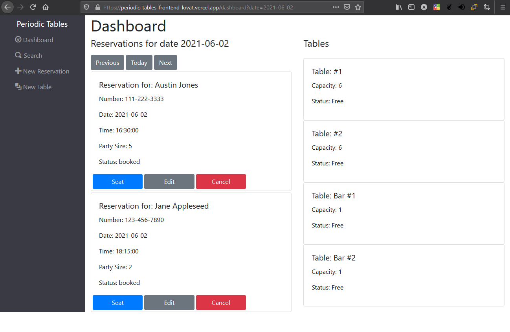

<br>

## `/dashboard?date=YYYY-MM-DD`

<hr>

When /dashboard is given a date query, and the date is in the provided format, the reservations for that date are displayed. No information about the tables will change based on the date query.

<br>

## `/reservations/new`

<hr>

This route displays a form that allows the user to create a new reservation.

After the reservation is submitted, the React application will go back to the dashboard and display the reservations belonging to the date of the newly created reservation.

### Before

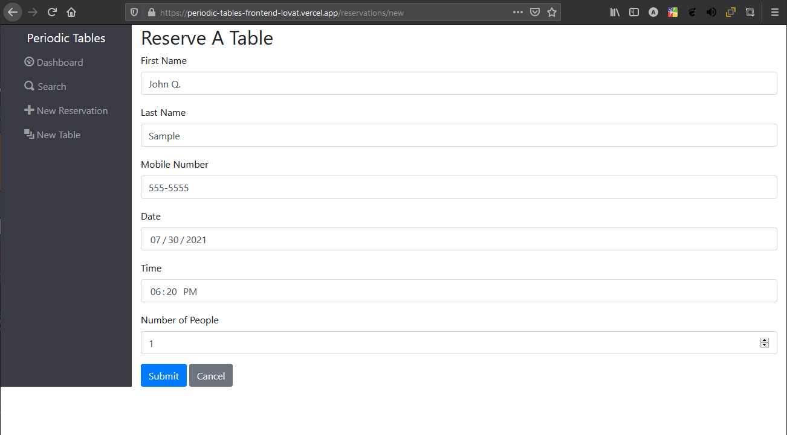

### After

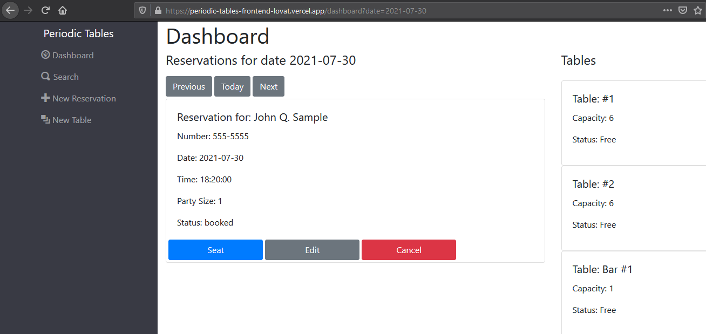

<br>

## `/tables/new`

<hr>

Here, a form that allows the user to create a new table in the system displays.

After the table is submitting, the React application will go back to the dashboard for the most recent date that was accessed before the form was used. For instance, if the last date accessed was 2022-06-01, after the table is created, the dashboard will push to that date. The new table will be displayed in the list of tables.

### Before

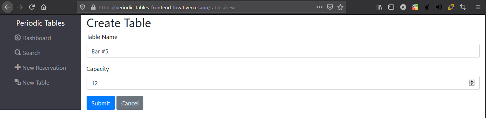

### After

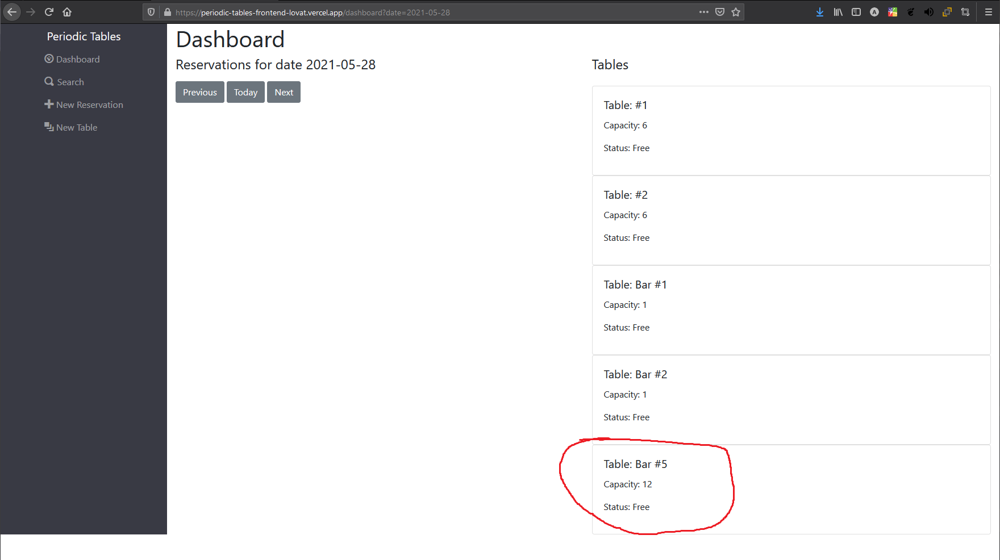

<br>

## `/reservations/:reservation_id/seat`

<hr>

If a reservation is booked, and a table has no party at it currently, the user can seat a reservation party at a table. Also, on the dashboard page, a user is able to "finish" a table. At this point, the table's reservation status is cleared, and the reservation is determined to be "finished".

### Before Seat Button is Clicked

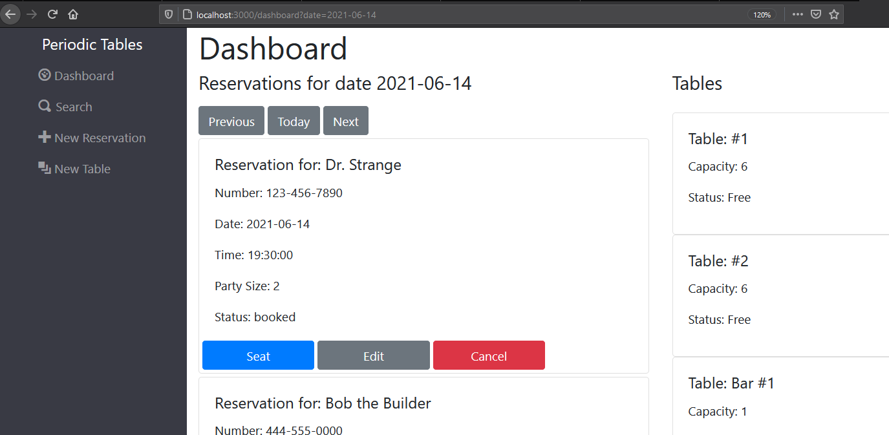

### Seat Form

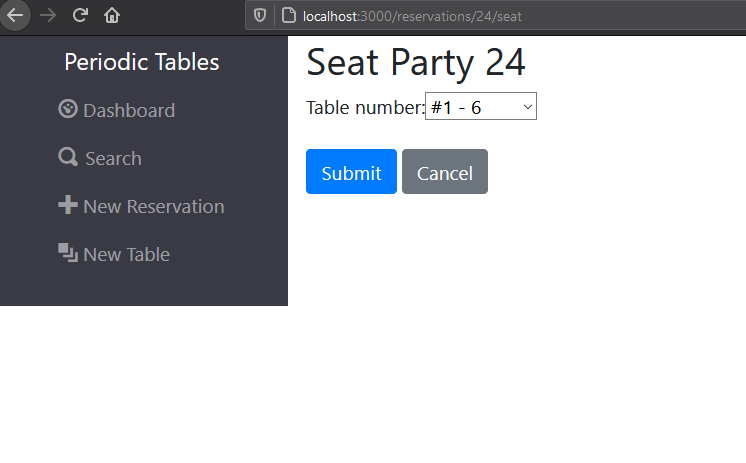

### Dr. Strange is Seated at Table #1

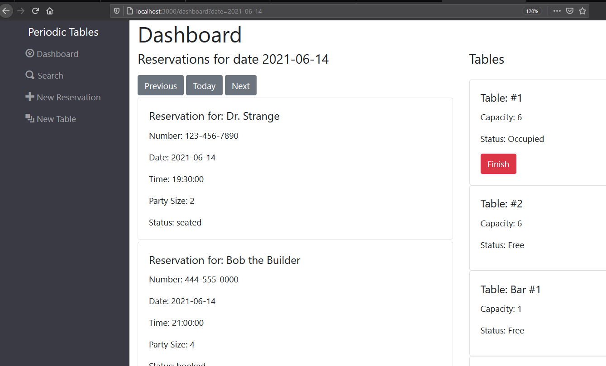

### Dr. Strange is Finished Eating, So the Table can be Cleared

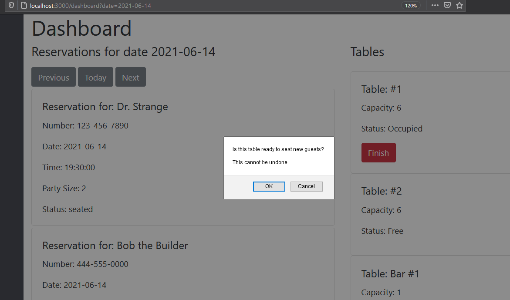

### Dr. Strange's Reservation is Removed from Dashboard

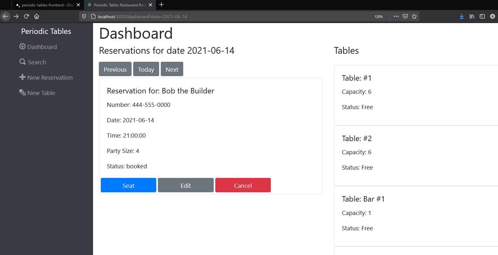

<br>

## `/search`

<hr>

The Search component will allow the user to search for reservations by customer phone number. Partial matches are acceptable, and the API will return reservations for such matches. If no results are found, the page displays "No reservations found".

### Search Matches Reservation Number

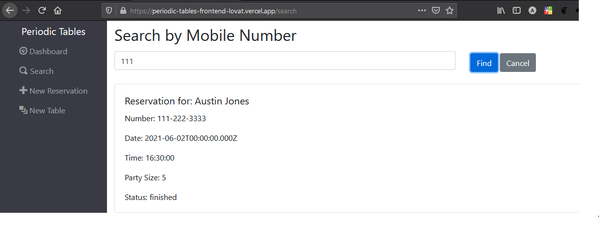

### No results

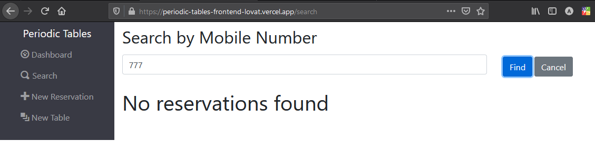

<br>

# Technologies Used

The PERN stack was used to build this application. The PERN stack includes, but is not limited to: PostgreSQL, Express.js, React.js, Node.js. Twitter Bootstrap 4.5.2 is also used on the frontend.

ElephantSQL PostgreSQL instances are used to store the data. Node.js in conjuction with Knex.js are used to update and interface with the data instances. Express.js version 4 is being used to handle the routing between the requests and the responses.

Facebook React.js is used on the frontend to create a responsive, dynamic web application for the user. I am using functional, hook-based React as opposed to its object-oriented counterpart. Throughout the frontend application, many hooks are used to simplify flow and layout of the application. There is plenty of React + ES6 + Bootstrap magic happening.

<br>

# Installation Instructions

In order to effectively install and use this application locally, you will need to either clone the repo from this [GitHub](https://github.com/austinhjones3/periodic-tables) or download the zip. You will then need to navigate to the top level of the project in your bash terminal and:

1. run `npm i`
2. `cd front-end && npm i`
3. `cd ../back-end && npm i`

Now that you have all of the scripts installed, you will need two different PostgreSQL database instances to either run the application locally or test it.

You must make a `.env` file in both the front-end and back-end directories.

Load the back-end `.env` file with two environment variables with the values of your two database URLs like so:

```
DATABASE_URL_DEVELOPMENT=development-data-base-url-goes-here
DATABASE_URL_TEST=test-data-base-url-goes-here
```

In the front-end `.env` file, enter:

```
REACT_APP_API_BASE_URL=http://localhost:5000
```

Now you will need to migrate the tables to the development database. Don't bother doing it for the test database, though. The tests are carrying that out for you each time. From the back-end folder:

1. `npx knex migrate:latest`
2. `npx knex seed:run`

Now you are ready to run the server locally. From the top level of the project, run `npm run start:dev` if you would like to run the server and application.

If you would like to test the application, you can view the `package.json` files and use the testing scripts provided there. Unfortunately, some of the provided testing scripts do not function. However, the ones that certainly do are:

1. all of those that are structured like `test:5:backend` or `test:3:frontend`
2. `test:frontend` and `test:backend`
